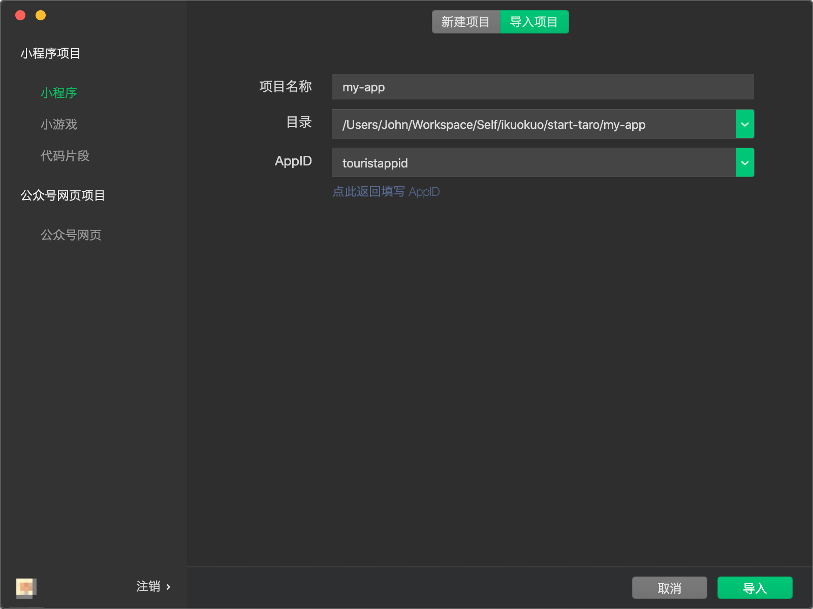
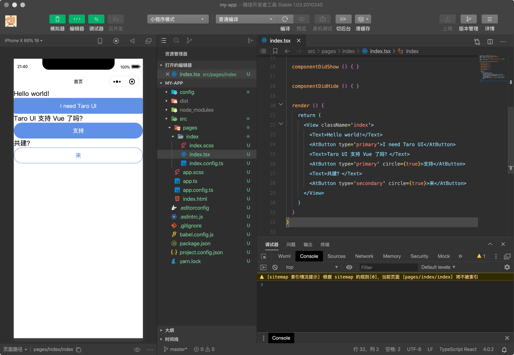

# Start [Taro]

[Taro]: https://taro-docs.jd.com/

[](https://github.com/nervjs/taro)

## 前提准备

```zsh
yarn global add @tarojs/cli
```

## 创建项目

```zsh
taro init my-app
```

输出信息：

```zsh
👽 Taro v3.0.16

Taro 即将创建一个新项目!
Need help? Go and open issue: https://tls.jd.com/taro-issue-helper

? 请输入项目介绍！
? 请选择框架 React
? 是否需要使用 TypeScript ？ Yes
? 请选择 CSS 预处理器（Sass/Less/Stylus） Sass
? 请选择模板源 Gitee（最快）
✔ 拉取远程模板仓库成功！
? 请选择模板 taro-ui

✔ 创建项目: my-app
...
✔ cd my-app, 执行 git init
✔ 安装成功
...
创建项目 my-app 成功！
请进入项目目录 my-app 开始工作吧！😝
```

## 运行程序

### 微信小程序

下载并打开[微信开发者工具](https://developers.weixin.qq.com/miniprogram/dev/devtools/download.html)，然后导入 `my-app` 项目：



编译预览：

```zsh
❯ yarn dev:weapp
yarn run v1.22.10
$ npm run build:weapp -- --watch
npm WARN lifecycle The node binary used for scripts is /var/folders/d3/gg88014s28j41dgh6dznfp7h0000gn/T/yarn--1605187598317-0.7594031278537579/node but npm is using /usr/local/bin/node itself. Use the `--scripts-prepend-node-path` option to include the path for the node binary npm was executed with.

> my-app@1.0.0 build:weapp /Users/ikuokuo/start-taro/my-app
> taro build --type weapp "--watch"

👽 Taro v3.0.16

Tips: 预览模式生成的文件较大，设置 NODE_ENV 为 production 可以开启压缩。
Example:
$ NODE_ENV=production taro build --type weapp --watch

生成  工具配置  /Users/ikuokuo/start-taro/my-app/dist/project.config.json

编译  发现入口  src/app.ts
编译  发现页面  src/pages/index/index.tsx
✅  编译成功


监听文件修改中...
```



编译打包：

```zsh
❯ yarn build:weapp
yarn run v1.22.10
$ taro build --type weapp
👽 Taro v3.0.16

生成  工具配置  /Users/ikuokuo/start-taro/my-app/dist/project.config.json

编译  发现入口  src/app.ts
编译  发现页面  src/pages/index/index.tsx
✅  编译成功

Hash: 3e1757774efcf01a6850
Version: webpack 4.42.0
Time: 6089ms
Built at: 11/12/2020 9:46:51 PM
                           Asset       Size  Chunks             Chunk Names
                          app.js     77 KiB       3  [emitted]  app
              app.js.LICENSE.txt  500 bytes          [emitted]
                        app.json  177 bytes          [emitted]
                        app.wxss    0 bytes       3  [emitted]  app
                       base.wxml   66.9 KiB          [emitted]
                         comp.js   72 bytes       5  [emitted]  comp
                       comp.json   54 bytes          [emitted]
                       comp.wxml   84 bytes          [emitted]
            pages/index/index.js    150 KiB       6  [emitted]  pages/index/index
pages/index/index.js.LICENSE.txt   1.21 KiB          [emitted]
          pages/index/index.json   71 bytes          [emitted]
          pages/index/index.wxml   82 bytes          [emitted]
          pages/index/index.wxss   1.44 KiB       6  [emitted]  pages/index/index
                      runtime.js   1.46 KiB       0  [emitted]  runtime
                         taro.js   94.4 KiB       1  [emitted]  taro
                       utils.wxs  981 bytes          [emitted]
                      vendors.js   13.5 KiB       2  [emitted]  vendors
          vendors.js.LICENSE.txt  295 bytes          [emitted]
Entrypoint app.config = runtime.js
Entrypoint pages/index/index.config = runtime.js
Entrypoint app = runtime.js taro.js vendors.js app.wxss app.js
Entrypoint comp = runtime.js taro.js vendors.js comp.js
Entrypoint pages/index/index = runtime.js taro.js vendors.js pages/index/index.wxss pages/index/index.js

✨  Done in 11.08s.
```

## 基础教程

根据创建项目时的选择，继续阅读教程。例如本文的选择，请阅读：

* [React](https://taro-docs.jd.com/taro/docs/react)
* [Taro UI](https://taro-ui.jd.com/#/docs)

## 参考

* [taro](https://github.com/nervjs/taro)
* [Taro Docs](https://taro-docs.jd.com/)
* [Taro UI](https://taro-ui.jd.com/)
